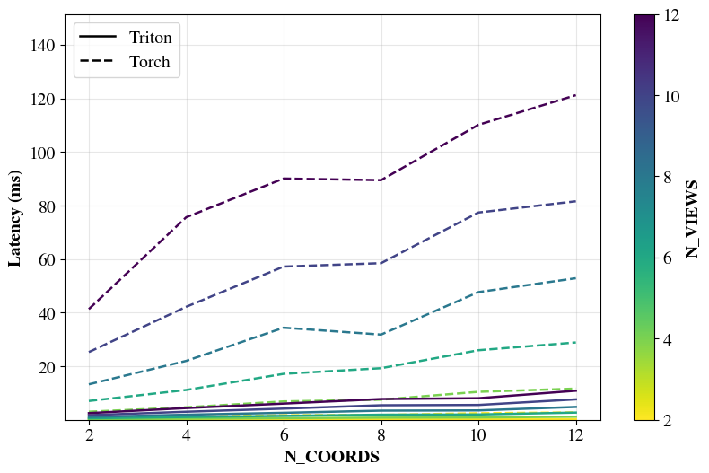
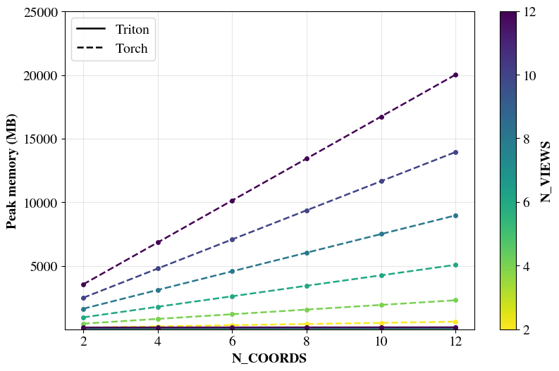

# Fused Deformable Scaled Dot-Product Multi-Head Attention (Triton)

This repository contains a trition implementation of deformable scaled dot-product multi-head attention, where the grid sampling and (flash) attention are fused into a single kernel, thus significantly reducing the  memory footprint and latency sourced from materializing the sampled intermediate tensor on HBM. The repository also includes a PyTorch front-end op with autograd support for it.


## Usage

### Prerequisites

This project has currently been tested with: 

- Python 3.11.11
- PyTorch 2.5.1
- CUDA 11.8
- Triton 3.1.0

but it may also work with other versions.

### Quick start

Example:
```python
import torch
from ops.triton import deform_sdpa_triton as fused_deform_sdpa

if __name__ == '__main__':

B, N_VIEWS, N_SAMPLES, N_HEADS, HEAD_DIM, W_IMG, H_IMG, sm_scale = 2, 8, 32, 16, 32, 14, 14, 0.5

try:
    device = torch.device('cuda', torch.cuda.current_device())
except (AssertionError, RuntimeError):
    device = torch.device('cpu')

q = torch.randn(B, N_VIEWS, N_HEADS, W_IMG * H_IMG, HEAD_DIM, device=device, dtype=torch.float32, requires_grad=True)
k = torch.randn(B, N_VIEWS, N_HEADS, W_IMG * H_IMG, HEAD_DIM, device=device, dtype=torch.float32, requires_grad=True)
v = torch.randn(B, N_VIEWS, N_HEADS, W_IMG * H_IMG, HEAD_DIM, device=device, dtype=torch.float32, requires_grad=True)
coords = torch.rand(B, N_VIEWS, W_IMG * H_IMG, N_VIEWS, N_SAMPLES, 2, device=device, dtype=torch.float32)

out = fused_deform_sdpa(q, k, v, coords, W_IMG, H_IMG, sm_scale)

dout = torch.randn_like(out)
out.backward(dout)
```

## Performance

Compared with the PyTorch implemented baseline, this implementation reduces peak memory usage by 10×–100× and is also 10×–100× faster (forward).

- NVIDIA RTX A6000

 


## Running benchmarks

```bash
python benchmarks/bench_deformable_sdp.py --b 2 --h 8 --d 32 --iw 18
```

## Remarks

This project was developed as a way to learn Triton and references many existing works. It is now released into the public domain with the intention of benefiting the community. If you find this work useful, I’d be very happy.